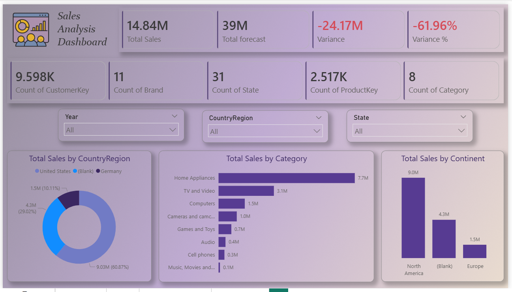
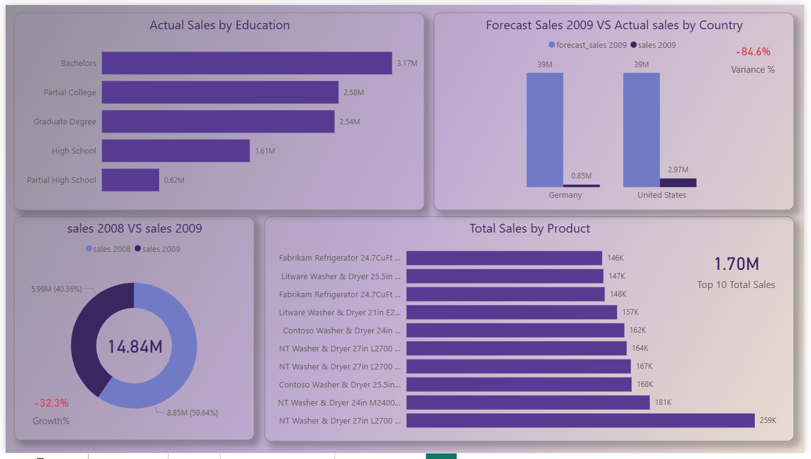
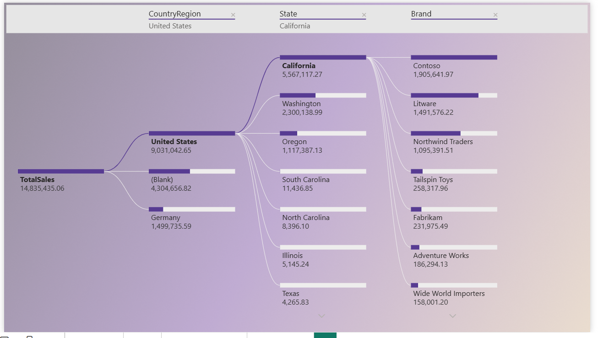
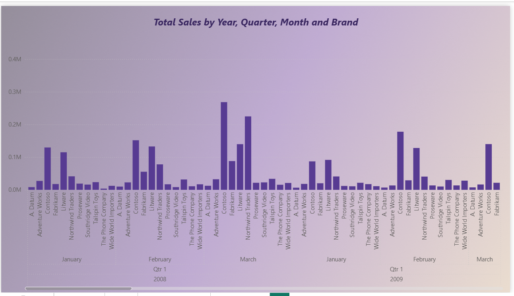

# Customer Sales Analysis Dashboard - Power BI

## 📊 Project Overview

This project presents an **interactive Sales Analysis Dashboard** built using **Power BI** to analyze customer sales performance, product categories, regional distribution, and forecast comparison.

The dashboard provides insights into **sales trends, top products, customer distribution, and forecast variance**, helping businesses understand their performance across different dimensions.

The **dashboard layout and UI design were first created using Figma**, then implemented in Power BI to achieve a clean and modern visualization style.

---

## 🖼 Dashboard Preview

### Main Dashboard

### Detailed Analysis

### Sales By Country and Brand

### Sales by Year (Drill Up-Down)

---

## 🎯 Business Objectives

The dashboard helps answer key business questions such as:

* What is the **total sales performance**?
* How does **actual sales compare to forecasted sales**?
* Which **product categories generate the highest revenue**?
* Which **regions and states contribute the most to sales**?
* What are the **top-performing products**?
* How do **sales vary by customer education level**?

---

## 📈 Key KPIs

The dashboard highlights important business metrics including:

* **Total Sales**
* **Total Forecast Sales**
* **Sales Variance**
* **Variance Percentage**
* **Total Customers**
* **Number of Brands**
* **Number of States**
* **Number of Product Keys**
* **Number of Categories**

---

## 📊 Dashboard Features

### 1️⃣ Sales Distribution

* Total Sales by **Country/Region**
* Total Sales by **Continent**
* Total Sales by **State**

### 2️⃣ Product Performance

* Total Sales by **Category**
* **Top 10 Products** based on total sales

### 3️⃣ Customer Insights

* Actual Sales by **Education Level**
* Customer segmentation analysis

### 4️⃣ Sales Comparison

* **Sales 2008 vs Sales 2009**
* **Forecast Sales vs Actual Sales**

### 5️⃣ Interactive Filters

Users can filter the dashboard using:

* Year
* Country / Region
* State
* Brand

---

## 🛠 Tools & Technologies

* **Power BI** → Data modeling and dashboard creation
* **Power Query** → Data cleaning and transformation
* **DAX** → Measures and calculations
* **Figma** → Dashboard layout and UI design

---

## 📂 Project Files

The repository includes:

* Power BI dashboard file (.pbix)
* Dataset used for analysis
* Dashboard screenshots
* Project documentation

---

## 🚀 Key Insights

Some insights discovered from the analysis:

* **Home Appliances** category generates the highest sales.
* **North America** contributes the largest share of revenue.
* There is a **significant gap between forecasted and actual sales**.
* A small number of products drive a large percentage of total revenue.

---

## 📬 Contact

If you have any feedback or suggestions, feel free to connect with me.

**Author:** Marwa Mohamed
🔗 GitHub: https://github.com/marwamohamed51

